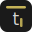

<!-- prettier-ignore -->
<div align="center">



# Scratchpad

[](https://svelte.dev)
[](https://vitejs.dev)
[](https://tailwindcss.com)
[](https://playwright.dev)

A local-first developer clipboard. Paste code, images, or text — everything stays in your browser.<br>
No backend. No account. No tracking.

[**Try it live**](https://sanjaybaskaran01.github.io/scratchpad/) · [Getting started](#getting-started) · [Features](#features) · [Keyboard shortcuts](#keyboard-shortcuts)

</div>

---

## Getting Started

```bash
npm install
npm run dev          # → http://localhost:5173/app/
```

> [!TIP]
> Scratchpad is a PWA — you can install it from your browser for a standalone experience.

## How It Works

Press **any key** to open the scratchpad, an ephemeral textarea that captures your thought immediately. Type freely, then hit <kbd>Cmd</kbd>+<kbd>Enter</kbd> to save it as a **clip**. Or just paste — the language is auto-detected and syntax-highlighted.

Clips live in two tiers:

- **Ephemeral** — stored in `sessionStorage`, expires after 24 hours
- **Pinned** — persisted to `IndexedDB`, kept indefinitely

Images are always persisted to IndexedDB.

### Peer-to-Peer Sharing

Send any text clip to another browser or device over **WebRTC** via PeerJS. The sender generates an 8-character pairing code; the receiver enters it to connect. No server ever touches the data.

## Features

| | |
|:--|:--|
| **Keyboard-first** | Full shortcut set — navigate, edit, delete, pin, copy, share without touching the mouse |
| **Auto language detection** | Pastes are classified and syntax-highlighted automatically via highlight.js |
| **Full-text search** | FlexSearch-powered instant filtering across all clip content |
| **P2P sharing** | WebRTC data channel transfers clips directly between browsers |
| **Compression** | Large text clips are transparently compressed with lz-string |
| **Duplicate detection** | SHA-256 content hashing prevents storing the same content twice |
| **Mobile responsive** | Slide-out drawer sidebar, safe-area support, touch swipe gestures |
| **PWA ready** | Installable as a standalone app with offline support |

## Keyboard Shortcuts

| Key | Action |
|:---:|:-------|
| <kbd>any char</kbd> | Open scratchpad |
| <kbd>Cmd</kbd>+<kbd>Enter</kbd> | Save scratchpad as clip |
| <kbd>Esc</kbd> | Close scratchpad / clear search |
| <kbd>j</kbd> <kbd>k</kbd> | Navigate clips |
| <kbd>i</kbd> | Edit selected clip |
| <kbd>x</kbd> | Delete selected clip |
| <kbd>z</kbd> | Undo last deletion |
| <kbd>p</kbd> | Pin / unpin |
| <kbd>c</kbd> | Copy to clipboard |
| <kbd>s</kbd> | Copy share URL |
| <kbd>n</kbd> | Open scratchpad |
| <kbd>/</kbd> or <kbd>Cmd</kbd>+<kbd>K</kbd> | Focus search |
| <kbd>?</kbd> | Show shortcut overlay |

## Tech Stack

| Layer | Tool | Role |
|:------|:-----|:-----|
| UI | **Svelte 5** | Runes-mode reactive components |
| Build | **Vite 6** | Dev server + production bundler |
| Styling | **Tailwind CSS 4** | Utility-first design system |
| Syntax | **highlight.js** | Language detection + highlighting |
| Search | **FlexSearch** | In-memory full-text index |
| P2P | **PeerJS** | WebRTC signaling + data channels |
| Storage | **idb** | Promise-based IndexedDB wrapper |
| Compression | **lz-string** | LZ-based UTF-16 string compression |

## Storage Model

| Data | Backend | Key / Store |
|:-----|:--------|:------------|
| Ephemeral clips | `sessionStorage` | `scratchpad_session_clips` |
| Pinned clips + images | `IndexedDB` | `scratchpad_db` → `clips` |
| Image blobs | `IndexedDB` | `scratchpad_db` → `blobs` |
| Settings | `localStorage` | `scratchpad_settings` |

## Project Structure

<details>
<summary>View full tree</summary>

```
src/
  App.svelte                 # Root — paste handler, shortcuts, state wiring
  main.js                    # Entry point
  components/
    Header.svelte            # Title, filter tabs, search, Receive button
    Sidebar.svelte           # Clip list + mobile drawer
    SidebarItem.svelte       # Individual sidebar entry
    ClipFeed.svelte          # Main content column
    ClipCard.svelte          # Single clip — edit, copy, pin, share, delete, P2P
    CodeBlock.svelte         # Syntax-highlighted code
    TextBlock.svelte         # Plain text with line count
    ImageBlock.svelte        # Image viewer + lightbox
    Scratchpad.svelte        # Ephemeral typing area (any-key trigger)
    PasteZone.svelte         # Empty state when no clips exist
    P2PModal.svelte          # Send/receive P2P modal
    Toast.svelte             # Notifications
    ShortcutOverlay.svelte   # Keyboard shortcut help (? key)
    ImageModal.svelte        # Full-screen image lightbox
  lib/
    clips.js                 # Content detection, compression, hashing, optimization
    storage.js               # IndexedDB + sessionStorage abstraction
    sharing.js               # URL share encoding/decoding
    highlight.js             # Language registration + auto-detect
    p2p.js                   # PeerJS WebRTC wrapper
  state/
    clips.svelte.js          # Reactive clip list, filter, search
    ui.svelte.js             # Reactive UI state (toasts, modals, scratchpad)
css/
  app.css                    # Tailwind theme, animations, global styles
```

</details>

### Multi-Page Build

| Route | Source | Purpose |
|:------|:-------|:--------|
| `/` | `index.html` | Landing page — static HTML, no Svelte |
| `/app/` | `app/index.html` | Svelte application |

Configured via `rollupOptions.input` in `vite.config.js`.

## Scripts

```bash
# Development
npm run dev              # Dev server with HMR
npm run build            # Production build → dist/
npm run preview          # Preview production build locally

# Testing
npm test                 # Unit tests (Vitest)
npm run test:watch       # Unit tests in watch mode
npm run test:e2e         # E2E tests (Playwright — requires build first)
npm run test:e2e:ui      # E2E with Playwright UI
npm run test:all         # Unit + E2E
```
